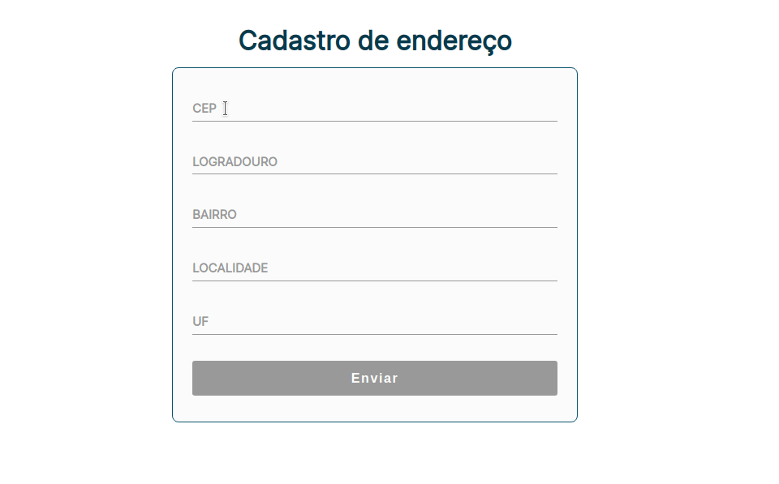

# Cadastro de Endereço com Consulta por CEP
   

Consulta o CEP informado com validação em tempo de digitação. Ao verificar que o valor é válido, será realizado uma busca na API Viacep para o preenchimento automático dos campos retornados pela API.

### Features:
* Validação e máscara do CEP em tempo de digitação;
* Auto preenchimento dos valores retornados da API;
* Verificação de campos vazios com mensagem personalizada;
* Estilização de campos inválidos e válidos;
* Desativação do botão enviar e atívar apenas quando todos os valores obrigatórios forem preenchidos;
* Preparação de um objeto json com todos os dados de endereço;

### Tecnologias:
* HTML
* CSS
* Javascript (Fetch)